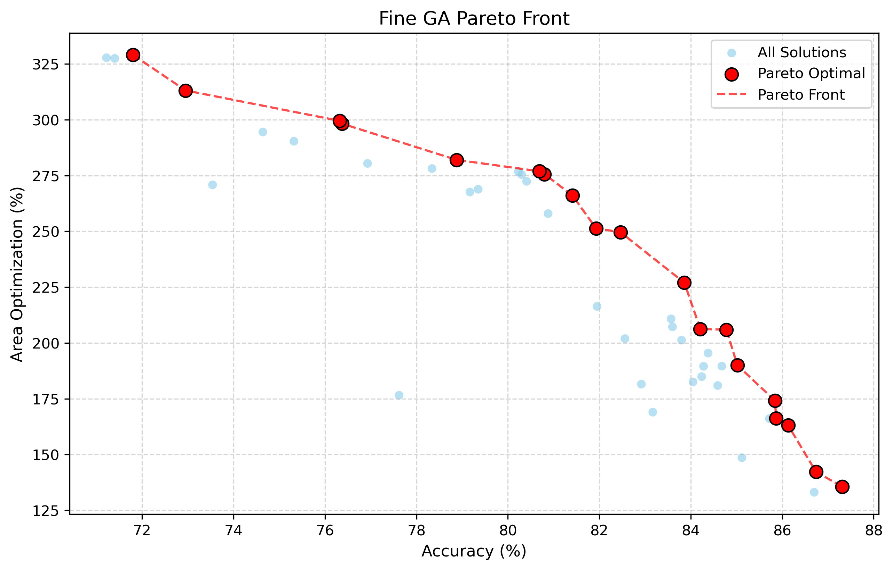
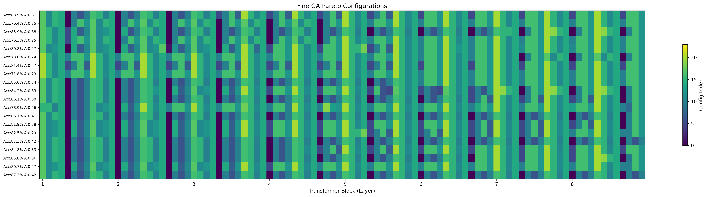

# ViT-CIM Design Space Exploration

基于遗传算法的ViT神经网络在存内计算(CIM)硬件上的设计空间探索工具。

## 项目简介

本项目针对ViT-tiny模型在混合SRAM/NVM存内计算架构上的部署进行设计空间探索。通过两阶段遗传算法，在模型准确率和芯片PPA（Power, Performance, Area）之间寻找最优的量化配置和硬件映射方案。

> **注**: 在GA搜索阶段，为了加速评估，我们将PPA简化为Area进行评估。最终在Pareto前沿找到的解，需要结合更详细的PPA模型进行评估，以确定最终的硬件设计方案。

## 示例结果

以下结果通过种群大小50、粗粒度GA 5代、细粒度GA 5代的初步实验得到：

### 细粒度GA Pareto前沿



### 细粒度GA Pareto最优配置热力图



### 核心特性

- **两阶段遗传算法**
  - 第一阶段：粗粒度搜索（8维group配置空间）
  - 第二阶段：细粒度搜索（96维layer配置空间）

- **混合存内计算架构**
  - SRAM：高精度、大面积、无variation
  - NVM：低精度、小面积、有variation噪声

- **多目标优化**
  - 最大化模型准确率
  - 最优化芯片PPA（搜索阶段简化为Area，最终需详细评估）
  - Pareto前沿分析

## 项目结构

```
D:/GA/
├── config/                 # 配置模块
│   ├── __init__.py
│   └── global_config.py   # 全局配置文件（重要参数集中管理）
│
├── core/                   # 核心模块
│   ├── __init__.py
│   ├── model_builder.py   # 模型构建
│   ├── quantization.py    # 量化和噪声实现
│
├── evaluators/            # 评估器模块
│   ├── __init__.py
│   ├── accuracy_evaluator.py  # 准确率评估
│   └── area_evaluator.py      # 面积评估
│
├── algorithms/            # 遗传算法模块
│   ├── __init__.py
│   ├── ga_base.py        # GA基类
│   ├── coarse_ga.py      # 粗粒度GA
│   └── fine_ga.py        # 细粒度GA
│
├── analysis/              # 结果分析模块
│   ├── __init__.py
│   └── pareto_analysis.py # Pareto前沿分析
│
├── outputs/               # 输出目录（自动创建）
│   ├── coarse_ga/        # 粗粒度GA结果
│   ├── fine_ga/          # 细粒度GA结果
│   └── analysis/         # 分析图表
│
├── main.py               # 主运行脚本
└── README.md             # 本文件
```

## 快速开始

### 1. 环境要求

```bash
Python >= 3.8
torch >= 1.10
torchvision
timm
numpy
matplotlib
tqdm
```

### 2. 配置参数

所有重要参数都集中在 `config/global_config.py` 中，包括：

- **硬件配置** (`HardwareConfig`)
  - `CONFIG_TABLE`: 配置表（量化位宽、NVM位数）
  - `NOISE_SIGMA`: NVM噪声强度
  - `SRAM_CELL_AREA_F2`, `NVM_CELL_AREA_F2`: 单元面积

- **层分组配置** (`LayerGroupConfig`)
  - `LAYER_TO_GROUP`: 96层到8组的映射
  - `GROUP_ALLOWED_CONFIGS`: 每组允许的配置索引

- **GA参数** (`CoarseGAConfig`, `FineGAConfig`)
  - `POPULATION_SIZE`: 种群大小
  - `MAX_GENERATIONS`: 最大迭代代数
  - `ACC_CONSTRAINT`: 准确率约束
  - `CROSSOVER_*`, `MUTATION_*`: 交叉和变异参数

### 3. 运行示例

#### 完整运行两阶段GA

```python
python main.py
```

#### 自定义参数运行

```python
from main import run_two_stage_ga

run_two_stage_ga(
    # 粗粒度GA
    coarse_population_size=100,
    coarse_max_generations=100,
    coarse_acc_constraint=80.0,

    # 细粒度GA
    fine_population_size=50,
    fine_max_generations=20,
    fine_acc_constraint=80.0,

    seed=42
)
```

#### 只运行粗粒度GA

```python
from algorithms import run_coarse_ga

best, history = run_coarse_ga(
    population_size=50,
    max_generations=50,
    acc_constraint=75.0,
    seed=42
)
```

#### 只运行细粒度GA（需要先有粗粒度结果）

```python
from algorithms import run_fine_ga

best, history = run_fine_ga(
    population_size=50,
    max_generations=10,
    acc_constraint=75.0,
    seed=42
)
```

### 4. 结果分析

```python
from analysis import plot_pareto_front, plot_evolution_history

# 绘制Pareto前沿
plot_pareto_front("outputs/coarse_ga/final_population.csv")

# 绘制进化历史
plot_evolution_history(history)
```

## 配置说明

### CONFIG_TABLE 配置表

每个配置索引对应一个 `(quant_bits, nvm_bits)` 元组，其中：
- `quant_bits`: 总量化位宽
- `nvm_bits`: 分配给NVM的bit数（LSB部分），其余为SRAM（MSB部分）

```python
CONFIG_TABLE = [
    (8, 4),  # index 0: INT8, SRAM/NVM = 4/4
    (8, 5),  # index 1: INT8, SRAM/NVM = 3/5
    ...
    (3, 3),  # index 23: INT3, SRAM/NVM = 0/3
]
```

例如：对于配置 (8, 5)，表示8bit量化，其中高3bit使用SRAM（无噪声），低5bit使用NVM（有variation噪声）。

### 层分组策略

ViT-tiny模型共有96层，根据层的种类可分为8组：
- Group 0 (Q Linear): Q线性层
- Group 1 (K Linear): K线性层
- Group 2 (V Linear): V线性层
- Group 3 (QK^T): QK^T矩阵乘（固定SRAM，仅量化敏感度分析）
- Group 4 (AV): AV矩阵乘（固定SRAM，仅量化敏感度分析）
- Group 5 (Output Linear): 输出投影层
- Group 6 (FC1): MLP第一层
- Group 7 (FC2): MLP第二层

注：QK^T和AV层由于需要频繁刷新，固定使用SRAM实现，仅需进行量化敏感度分析。

**配置限制策略**：根据每层种类对量化和噪声的敏感度分析结果，在第一阶段（粗粒度GA）搜索时，对每种层类型限制其可选的配置集合。例如，对噪声敏感的层类型限制选择更多SRAM位宽的配置，对噪声不敏感的层类型可以选择更多NVM位宽的配置以节省面积。

### 面积计算模型

```
total_area = SRAM_area + NVM_area

SRAM_area = num_weights × sram_bits × SRAM_CELL_F2 × (process_nm/1000)²
NVM_area  = num_weights × nvm_bits  × NVM_CELL_F2  × (process_nm/1000)²
```

## 实验流程

1. **修改配置**: 编辑 `config/global_config.py` 中的参数
2. **运行GA**: 执行 `python main.py`
3. **查看结果**:
   - CSV文件: `outputs/coarse_ga/final_population.csv`
   - 图表: `outputs/analysis/*.png`
4. **分析Pareto前沿**: 选择满足需求的配置方案
5. **PPA精细评估**: 对Pareto前沿上的候选配置进行更详细的PPA评估，确定最终硬件方案

## 注意事项

1. **路径配置**:
   - 模型路径和数据集路径在 `PathConfig` 中配置
   - 如果本地不存在，会使用随机初始化（仅用于测试）

2. **计算资源**:
   - 准确率评估需要GPU加速
   - 完整运行可能需要较长时间

3. **结果复现**:
   - 设置相同的 `seed` 可以复现结果
   - 注意检查配置文件是否一致

## 扩展功能

### 添加新的配置

在 `HardwareConfig.CONFIG_TABLE` 中添加新的 `(quant_bits, nvm_bits)` 配置。

### 修改层分组

在 `LayerGroupConfig.LAYER_TO_GROUP` 中调整层到组的映射关系。

### 自定义评估函数

继承 `GeneticAlgorithmBase` 并重写 `evaluate_individual` 方法。

## 常见问题

**Q: 如何调整搜索空间？**

A: 修改 `LayerGroupConfig.GROUP_ALLOWED_CONFIGS`，限制每组可选的配置索引。

**Q: 如何加快搜索速度？**

A: 减少 `POPULATION_SIZE` 和 `MAX_GENERATIONS`，或使用更小的测试数据集。

**Q: 如何处理准确率约束？**

A: 设置 `ACC_CONSTRAINT` 参数，GA会优先满足准确率要求。

---

## 补充材料：遗传算法介绍

### 什么是遗传算法？

遗传算法（Genetic Algorithm, GA）是一种模拟自然选择和遗传机制的优化算法，属于进化计算的一个分支。它通过模拟生物进化过程中的"选择"、"交叉"和"变异"操作，在解空间中搜索最优解。

### 遗传算法的基本流程

```
1. 初始化种群 → 2. 评估适应度 → 3. 选择父代 → 4. 交叉生成子代 → 5. 变异 → 6. 评估 → 7. 精英保留 → 返回步骤3
```

### 本项目中的遗传算法实现

#### 1. 个体编码

- **粗粒度GA**: 8维向量，每个维度代表一类层（Q/K/V/QK/AV/Output/FC1/FC2）
- **细粒度GA**: 96维向量，每个维度代表一个具体的Transformer层

#### 2. 适应度评估

采用多目标优化，同时考虑：
- **准确率**: 模型在CIFAR-100上的Top-1准确率
- **PPA评估**: 芯片的Power、Performance、Area。在GA搜索阶段简化为Area评估以加速搜索，最终解需结合详细PPA模型进行评估

#### 3. 选择策略

采用**锦标赛选择（Tournament Selection）**：
- 从种群中随机选择若干个体
- 选择其中最优的个体作为父本
- 支持配置锦标赛规模（默认k=3）

#### 4. 交叉操作

- **单点交叉**: 随机选择切割点，交换父本的部分基因
- 交叉概率动态调整

#### 5. 变异操作

- **粗粒度GA**: 随机替换为同组允许的其他配置
- **细粒度GA**: 小步长变异（±[1,3]），保证局部搜索的稳定性

#### 6. 精英保留

- 保留每代中最优的个体（默认2%），直接进入下一代
- 防止最优解在进化过程中丢失

#### 7. 多目标优化

使用**Pareto支配**和**拥挤距离**进行多目标优化：
- **Pareto支配**: 如果个体A在所有目标上都不差于B，且至少在一个目标上更优，则A支配B
- **拥挤距离**: 衡量个体在目标空间中的密度，距离越大表示多样性越好

---

## 引用

如果使用本代码，请引用相关论文。

## 许可证

MIT License
